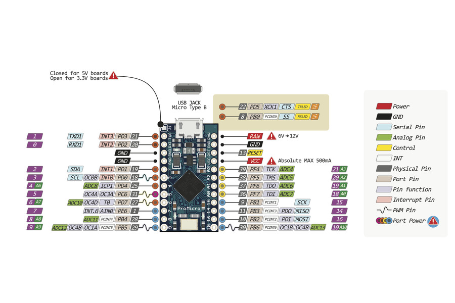

# Capacitance Keyboard

## Keyboard, Mouse, HID

Keyboard.h (and Mouse.h) only works on devices that use the ATmega32u4 processor, like the Leonardo or Micro.  See: https://www.arduino.cc/en/Reference/MouseKeyboard

## Capacitive Sensor

https://playground.arduino.cc/Code/CapacitiveSensor/

https://playground.arduino.cc/Main/CapacitiveSensor/

https://github.com/PaulStoffregen/CapacitiveSensor

## Inspiration:
https://makeymakey.com/

https://www.sparkfun.com/products/14478

https://github.com/sparkfun/MaKeyMaKey

https://www.instructables.com/community/How-does-Makey-Makey-sense-touch/
https://www.instructables.com/id/DIY-Makey-Makey-With-Arduino-Leonardo/

https://www.youtube.com/watch?v=gTU9NunYVnM

https://core-electronics.com.au/tutorials/capacitive-touch-with-makey-makey.html

## Arduino Pro Micro (32u4) pinout

## makey makey use cases inspiration

https://makeymakey.com/blogs/how-to-instructions/apps-for-plug-and-play

https://www.instructables.com/id/Makey-Makey-2/

https://makeymakey.com/blogs/how-to-instructions/getting-started-with-scratch

## My req

- min 6 buttons - 4 arrows, space, click
- pot to change sensitivity
- on/off for keyboard to disable keyboard / change mode ? (off / mouse/arrows/wsad)
- led to indicate button pressed - or just rely on TX/RX diodes...
