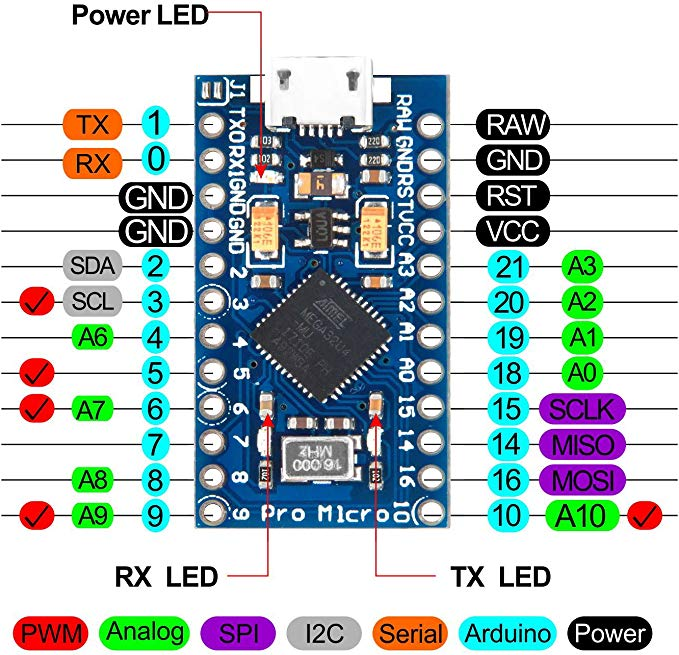

Keyboard.h (and Mouse.h) only works on devices that use the ATmega32u4 processor, like the Leonardo or Micro.  See: https://www.arduino.cc/en/Reference/MouseKeyboard

https://playground.arduino.cc/Code/CapacitiveSensor/
https://playground.arduino.cc/Main/CapacitiveSensor/
https://github.com/PaulStoffregen/CapacitiveSensor

Inspiration:
https://makeymakey.com/
https://www.sparkfun.com/products/14478
https://github.com/sparkfun/MaKeyMaKey

Arduino Pro Micro
32u4

